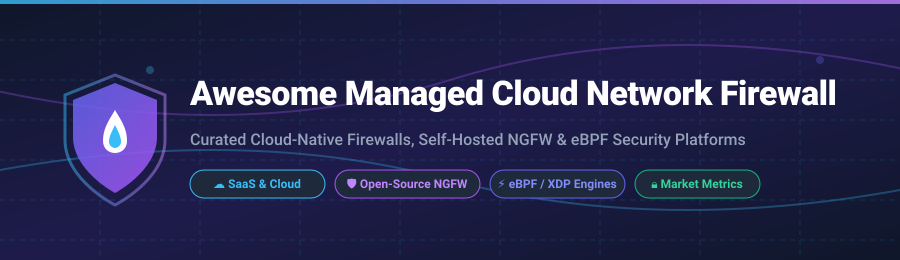

# 🛡️ Awesome Managed Cloud Network Firewall 🚀

   

## 📌 Top Managed Cloud Network Firewall Ecosystem & Open-Source Security Platforms

**Curated List of SaaS Products, Cloud-Native Firewalls, Self-Hosted NGFW & eBPF Security Engines**  

*Comprehensive Guide to AWS Network Firewall, Azure Firewall, GCP Cloud Armor, OPNsense, pfSense, Suricata & Kubernetes Firewalls*

---

### 💡 Overview & SEO Summary

This repository tracks notable **commercial managed cloud network firewall platforms**, **SaaS WAFs**, and **open-source GitHub security projects** that safeguard modern cloud workloads, virtual private clouds (VPCs), hybrid networks, and Kubernetes clusters. From fully managed enterprise cloud-native firewalls to high-performance eBPF/XDP packet filtering engines and virtual Next-Generation Firewalls (NGFW), this guide provides clear insights into pricing, free tier limits, market capitalization, and open-source GitHub star metrics.

---

## 📑 Table of Contents
- [📊 SaaS & Commercial Hosted Firewall Platforms](#-saas--commercial-hosted-firewall-platforms)
- [🔓 Open-Source GitHub Firewall Projects](#-open-source-github-firewall-projects)
- [💖 Support](#-support)
- [🤝 How to Contribute](#-how-to-contribute)
- [⚠️ Disclaimer](#%EF%B8%8F-disclaimer)
- [⭐ Star History](#-star-history)

---

## 📊 SaaS & Commercial Hosted Firewall Platforms

> **📈 Market Size & Industry Dynamics**:  
> The global **Cloud Network Firewall market** is estimated at **$5.2 Billion in 2026** and is projected to reach **$12.8 Billion by 2031 (CAGR ~19.7%)**. The sector is **moderately fragmented**, dominated by hyperscale cloud service providers (AWS, Microsoft Azure, Google Cloud) for native VPC controls, alongside enterprise cybersecurity giants (Palo Alto Networks, Fortinet, Cisco, Check Point) providing multi-cloud virtual appliances, and edge security leaders (Cloudflare).

*Note: Table sorted by Company Market Size / Revenue in descending order.*

| 🛡️ Product / Platform | 🏢 Company | 💰 Company Size / Revenue (Est.) | 💵 Starting Tier Pricing | 🆓 Free Tier Limit / Free Trial | ⚡ Primary Use Case & Highlights |
| :--- | :--- | :--- | :--- | :--- | :--- |
| **[Azure Firewall](https://azure.microsoft.com/en-us/products/azure-firewall/)** | Microsoft | **~$3.12 Trillion Valuation** | $1.25 per firewall hour + $0.016/GB processed | $200 free credit valid for 30 days | Cloud-native stateful inspection, TLS inspection & Azure IDPS |
| **[AWS Network Firewall](https://aws.amazon.com/network-firewall/)** | Amazon | **~$2.18 Trillion Valuation** | $0.395 per firewall endpoint hour + $0.065/GB processed | Free tier available via AWS Free Account ($300 credits for 30 days) | VPC-level protection, Suricata-compatible IPS, Transit Gateway integration |
| **[Google Cloud Cloud Armor](https://cloud.google.com/armor)** | Alphabet (Google) | **~$2.05 Trillion Valuation** | $0.75 per policy/month + $0.75 per rule/month ($0.05/10k requests) | $300 free trial credits for 90 days across GCP | GCP-native Layer 7 DDoS mitigation and adaptive WAF filtering |
| **[Cisco Secure Firewall](https://www.cisco.com/)** | Cisco Systems | **~$195 Billion Market Cap** | ~$350/month per virtual instance (BYOL/PayG) | 30-day free evaluation trial | Enterprise NGFW with Cisco Security Cloud Control integration |
| **[Palo Alto VM-Series Cloud](https://www.paloaltonetworks.com/)** | Palo Alto Networks | **~$110 Billion Market Cap** | ~$0.92 per hour (PAYG) or ~$2,800/year license | 30-day free trial on AWS/Azure Marketplaces | Virtual NGFW featuring App-ID, User-ID, and Content-ID |
| **[Fortinet FortiGate-VM](https://www.fortinet.com/)** | Fortinet | **~$60 Billion Market Cap** | ~$0.85 per hour (PAYG 1 vCPU) or ~$1,200/year | 60-day free evaluation license | Virtual NGFW powered by FortiOS with unified cloud security |
| **[Cloudflare Magic Firewall](https://www.cloudflare.com/)** | Cloudflare | **~$35 Billion Market Cap** | ~$200/month (Enterprise network addon packages) | Free tier available for Cloudflare Core (Magic Firewall requires Enterprise trial) | Cloud edge network-level packet filtering across global edge |
| **[Check Point CloudGuard](https://www.checkpoint.com/)** | Check Point | **~$22 Billion Market Cap** | ~$0.70 per hour (PAYG vCPU) | 30-day free marketplace trial | Unified multi-cloud network security and threat prevention |
| **[Sophos Cloud Firewall](https://www.sophos.com/)** | Sophos (Thoma Bravo) | **~$4 Billion Valuation** | ~$80/month per virtual firewall instance | 30-day free evaluation trial on Sophos Central | Cloud-managed firewall with synchronized security features |
| **[SonicWall NSv](https://www.sonicwall.com/)** | SonicWall (Private) | **~$1.5 Billion Valuation** | ~$65/month per virtual instance (NSv 100) | 30-day free evaluation trial | Virtual firewall for virtualized environments & hybrid cloud |

---

## 🔓 Open-Source GitHub Firewall Projects

*Open-source options, sorted by GitHub Stars_Count in descending order.*

| 🌟 Stars | 📦 Repository | 📜 License | 🎯 Highlights & Description |
| :---: | :--- | :--- | :--- |
|  | **[BunkerWeb](https://github.com/bunkerity/bunkerweb)** | AGPL-3.0 | 🛡️ **Cloud-Native Web Application Firewall (WAF)**. NGINX-based with ModSecurity integration, automated configuration for Docker/Kubernetes container labels. |
|  | **[Suricata](https://github.com/suricata/suricata)** | GPL-2.0 | ⚡ **High-performance Network IDS, IPS, and Network Security Monitoring engine**. Open-source standard for deep packet inspection. |
|  | **[OPNsense](https://github.com/opnsense/core)** | BSD-2-Clause | 🏰 **Leading modern open-source firewall distribution**. FreeBSD-based with REST API, ZFS boot environments, WireGuard/OpenVPN, and Suricata IPS. |
|  | **[OpenWrt](https://github.com/openwrt/openwrt)** | GPL-2.0 | 🌐 **Linux operating system targeting embedded network devices and cloud routers**. Extensible firewall (fw4/nftables) and packet filtering. |
|  | **[OWASP Coraza](https://github.com/corazawaf/coraza)** | Apache-2.0 | 🚀 **Modern Enterprise WAF written in Go**. 100% compatible with OWASP Core Rule Set v4, built for Kubernetes and Envoy proxies. |
|  | **[VyOS](https://github.com/vyos/vyos-1x)** | GPL-2.0 | 🔌 **Open-source network operating system** providing software-based routing, stateful firewall, VPN, and NAT for cloud hosts. |
|  | **[pfSense](https://github.com/pfsense/pfsense)** | Apache-2.0 | 🏛️ **Widely deployed open-source firewall distribution**. FreeBSD-based stateful packet filtering web GUI with Snort/Suricata support. |
|  | **[ModSecurity](https://github.com/owasp-modsecurity/ModSecurity)** | Apache-2.0 | 🔑 **Classic open-source WAF engine**. Operates as a module for Nginx, Apache HTTPd, and IIS with OWASP CRS support. |
|  | **[Polycube](https://github.com/polycube-network/polycube)** | Apache-2.0 | ⚡ **eBPF & XDP network service framework**. Includes `pcn-iptables` for high-throughput eBPF packet filtering with hash-table rule lookup. |
|  | **[neuwerk](https://github.com/moolen/neuwerk)** | MIT | ☁️ **Cloud-native eBPF network egress firewall**. Dynamic DNS-based allow/deny egress traffic filtering with Raft distributed consensus. |
|  | **[xdp-filter (xdp-tools)](https://github.com/xdp-project/xdp-tools)** | GPL-2.0 / LGPL-2.1 | 🏎️ **XDP-based high-speed packet filtering engine**. Hash-table rule lookup maintaining low latency for IPv4/IPv6 packet dropping. |
|  | **[IPFire](https://github.com/ipfire/ipfire-2.x)** | GPL-3.0 | 🔒 **Security-focused Linux firewall distribution**. Color-coded network zones (Green/Red/Blue/Orange) with built-in Pakfire package manager. |
|  | **[metal-stack firewall-controller](https://github.com/metal-stack/firewall-controller)** | MIT | ☸️ **Kubernetes controller for bare-metal firewalls**. Configures nftables and Suricata IDS dynamically based on CRDs. |
|  | **[fos1](https://github.com/GizmoTickler/fos1)** | MIT | ☸️ **Kubernetes-based router & firewall distribution on Talos Linux**. Includes eBPF packet processing, Suricata IDS, and Zeek DPI. |
|  | **[morfic](https://github.com/fire833/morfic)** | Open-Source | ☸️ **Kubernetes-native firewall/routing control plane** for managing network policies across user and kernel space. |

---

## 💖 Support

Thank you for exploring this curated repository! If you find this project helpful, please consider supporting it:
- ⭐ **Star** this repository to show your appreciation and help others discover it.
- 🍴 **Fork** and contribute your knowledge or submit improvements via Pull Requests.
- 📢 **Share** this list with fellow network engineers, security architects, and cloud practitioners.
- ☕ **Sponsor / Buy me a Coffee**: You can support ongoing maintenance via the [GitHub Sponsor Dashboard](https://github.com/sponsors/ishandutta2007).

---

## 🤝 How to Contribute

1. 🍴 **Fork** the repository.
2. 📝 **Add or edit** entries in `README.md` following the tabular markdown format.
3. ℹ️ **Provide essential details**: name, repository/website link, 1–2 sentence description, license, pricing, or Stars_Count.
4. 🚀 **Submit a Pull Request (PR)** with a clear explanation of your additions.

---

## ⚠️ Disclaimer

- ℹ️ This is a **community-curated list** for informational and educational purposes.
- 🛡️ Cloud network firewalls process sensitive production network traffic. Self-hosted and open-source solutions require proper security hardening, active patch management, and strict access controls.
- ⚡ **eBPF firewalls performance**: eBPF/XDP throughput depends on rule lookup algorithms (hash-table vs linear search).
- 🔐 **Management security**: Never expose firewall management consoles or admin interfaces directly to the public internet. Use secure VPNs, Zero-Trust Access, or SSH bastions.

---

## 🌟 Star History

---

  <b>Made for network engineers, cloud architects, and devsecops teams seeking cloud firewall clarity.</b> 
  <i>Star ⭐ this repository if you find it helpful!</i>

